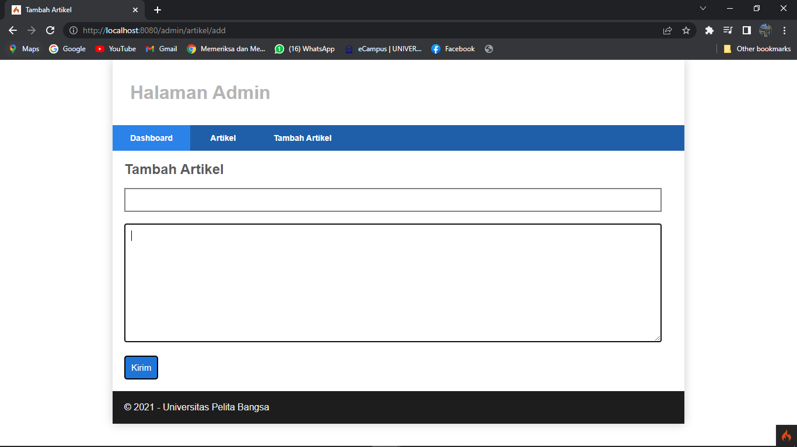
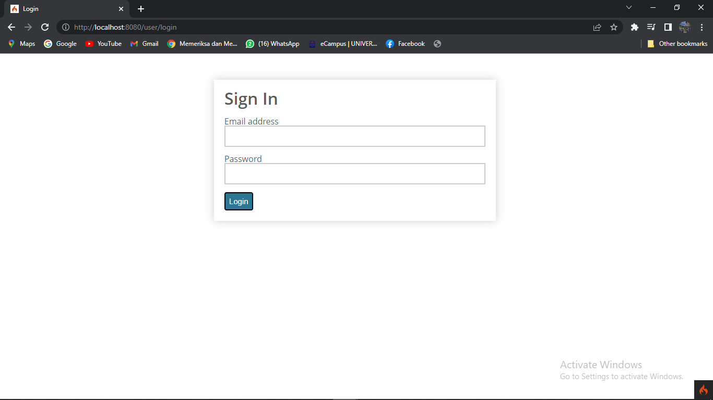

# **Praktikum 11**
  ---------------
|Nama			|Kelas		|NIM		|
|-----			|-----		|-----		|
|Syahru	Raga Ramdhani	|TI.20.A.2	|312010354	|

# Langkah Praktikum

### **Persiapan** <br>
Sebelum memulai menggunakan Framework Codeigniter, perlu dilakukan konfigurasi
pada webserver. Beberapa ekstensi PHP perlu diaktifkan untuk kebutuhan
pengembangan Codeigniter 4. <br>

Berikut beberapa ekstensi yang perlu diaktifkan: <br>
* **php-json** ekstension untuk bekerja dengan JSON;
* **php-mysqlnd** native driver untuk MySQL;
* **php-xml** ekstension untuk bekerja dengan XML;
* **php-intl** ekstensi untuk membuat aplikasi multibahasa;
* **libcurl** (opsional), jika ingin pakai Curl. <br>

Untuk mengaktifkan ekstensi tersebut, melalui **XAMPP Control Panel**, pada bagian Apache klik **Config -> PHP.ini** <br>
<br>

Pada bagian extention, hilangkan tanda ; (titik koma) pada ektensi yang akan diaktifkan. Kemudian simpan kembali filenya dan restart Apache web server. <br>
<br>

### **Instalasi Codeigniter 4** <br>
Untuk melakukan instalasi Codeigniter 4 dapat dilakukan dengan dua cara, yaitu cara
manual dan menggunakan composer. Pada praktikum ini kita menggunakan cara
manual.<br>
* Unduh **Codeigniter dari website** https://codeigniter.com/download
* Ekstrak file zip Codeigniter ke direktori **htdocs/lab11_ci.**
* Ubah nama directory **framework-4.x.xx menjadi ci4.
* buka browser dengan alamat http://localhost/lab11_ci/ci4/public/
<br>
### **Menjalankan CLI (Command Line Interface)** <br>
Codeigniter 4 menyediakan CLI untuk mempermudah proses development. Untuk
mengakses CLI buka terminal/command prompt.
<br>

Arahkan lokasi direktori sesuai dengan direktori kerja project dibuat (xampp/**htdocs/praktikum11/ci4**/)<br>

Perintah yang dapat dijalankan untuk memanggil CLI Codeigniter adalah;
``` php spark ``` 
<br>

### **Mengaktifkan Mode Debugging** <br>
Codeigniter 4 menyediakan fitur **debugging** untuk memudahkan developer untuk mengetahui pesan error apabila terjadi kesalahan dalam membuat kode program.<br>

Secara default fitur ini belum aktif. Ketika terjadi error pada aplikasi akan ditampilkan pesan kesalahan seperti berikut.
<br>

Semua jenis error akan ditampilkan sama. Untuk memudahkan mengetahui jenis
errornya, maka perlu diaktifkan mode debugging dengan mengubah nilai konfigurasi
pada environment variable **CI_ENVIRINMENT** menjadi **development**.
<br>

Ubah nama file **env** menjadi **.env** kemudian buka file tersebut dan ubah nilai variable **CI_ENVIRONMENT** menjadi **develoment**
<br>

Contoh error yang terjadi. Untuk mencoba error tersebut, ubah kode pada file **app/Controller/Home.php** hilangkan titik koma pada akhir kode.
<br>

### **Struktur Direktori** <br>
Untuk lebih memahami Framework Codeigniter 4 perlu mengetahui struktur direktori
dan file yang ada. Buka pada **Windows Explorer** atau dari **Visual Studio Code** -> **Open Folder**. <br>
* **.github** folder ini kita butuhkan untuk konfigurasi repo github, seperti konfigurasi untuk build dengan github action;
* **app** folder ini akan berisi kode dari aplikasi yang kita kembangkan
* **public** folder ini berisi file yang bisa diakses oleh publik, seperti file index.php, robots.txt, favicon.ico, ads.txt, dll;
* **tests** folder ini berisi kode untuk melakukan testing dengan PHPunit;
* **vendor** folder ini berisi library yang dibutuhkan oleh aplikasi, isinya juga termasuk kode core dari system CI.
* **writeable** folder ini berisi file yang ditulis oleh aplikasi. nantinya, kita bisa pakai untuk menyimpan file yang di-upload, logs, session, dll. <br>

Sedangkan file-file yang berada pada root direktori CI sebagai berikut.
* **.env** adalah file yang berisi variabel environment yang dibutuhkan oleh aplikasi.
* **.gitignore** adalah file yang berisi daftar nama file dan folder yang akan diabaikan oleh Git.
* **build** adalah script untuk mengubah versi codeigniter yang digunakan. ada versi release (stabil) dan development (labil).
* **composer.json** adalah file JSON yang berisi informasi tentang proyek dan daftar library yang dibutuhkannya. File ini digunakan oleh Composer sebagai acuan.
* **composer.lock** adalah file yang berisi informasi versi dari library yang digunakan aplikasi.
* **licence.txt** adalah file yang berisi penjelasan tentang lisensi Codeigniter;
* **phpunit.xml** adalah file XML yang berisi konfigurasi untuk PHPunit.
* **README.md** adalah file keterangan tentang codebase CI. Ini biasanya akan dibutuhkan pada repo github atau gitlab.
* **spark** adalah program atau script yang berfungsi untuk menjalankan server, generate kode, dll. <br>
<br>

Fokus kita pada folder **app**, dimana folder tersebut adalah area kerja kita untuk
membuat aplikasi. Dan folder **public** untuk menyimpan aset web seperti css, gambar, javascript, dll. <br>

### **Memahami Konsep MVC** <br>
Codeigniter menggunakan konsep MVC. MVC meripakan singkatan dari Model-View-Controller. MVC merupakan konsep arsitektur yang umum digunakan dalam pengembangan aplikasi. Konsep MVC adalah memisahkan kode program berdasarkan logic proses, data, dan tampilan. Untuk logic proses diletakkan pada direktori Contoller, Objek data diletakkan pada direktori Model, dan desain tampilan diletakkan pada direktori View. <br>

Codeigniter menggunakan konsep pemrograman berorientasi objek dalam mengimplementasikan konsep MVC <br>

**Model** merupakan kode program yang berisi pemodelan data. Data dapat berupa database ataupun sumber lainnya. <br>

**View** merupakan kode program yang berisi bagian yang menangani terkait tampilan user interface sebuah aplikasi. didalam aplikasi web biasanya pasti akan berhubungan dengan html dan css. <br>

**Controller** merupakan kode program yang berkaitan dengan logic proses yang menghubungkan antara view dan model. Controller berfungsi untuk menerima request dan data dari user kemudian diproses dengan menghubungkan bagian model dan view. <br>

**Routing dan Controller** <br>
Routing merupakan proses yang mengatur arah atau rute dari request untuk menentukan fungsi/bagian mana yang akan memproses request tersebut. Pada framework CI4, routing bertujuan untuk menentukan Controller mana yang harus merespon sebuah request. Controller adalah class atau script yang bertanggung jawab merespon sebuah request. <br>

Pada Codeigniter, request yang diterima oleh file index.php akan diarahkan ke Router untuk meudian oleh router tersebut diarahkan ke Controller. <br>

Router terletak pada file **app/config/Routes.php**
<br>

Pada file tersebut kita dapat mendefinisikan route untuk aplikasi yang kita buat. <br>

Contoh:
```$routes->get('/', 'Home::index');```
<br>
Kode tersebut akan mengarahkan rute untuk halaman home <br>

### **Membuat Route Baru** <br>
Tambahkan kode berikut ini di dalam **Routes.php** <br>

```
$routes->get('/about', 'Page::about');
$routes->get('/contact', 'Page::contact');
$routes->get('/faqs', 'Page::faqs');
```

Untuk mengetahui route yang ditambahkan sudah benar, buka CLI dan jalankan perintah berikut. <br>
``` php spark routes ```
<br>

Selanjutnya coba akses route yang telah dibuat dengan mengakses alamat url http://localhost:8080/about
<br>

Ketika diakses akan mucul tampilan error 404 file not found, itu artinya file/page tersebut tidak ada. Untuk dapat mengakses halaman tersebut, harus dibuat terlebih dahulu Contoller yang sesuai dengan routing yang dibuat yaitu Contoller Page. <br>

### **Membuat Controller** <br>
Selanjutnya adalah membuat Controller Page. Buat file baru dengan nama page.php pada direktori Controller kemudian isi kodenya seperti betikut. <br>
<br>

Selanjutnya refresh kembali browser, maka akan ditampilkan hasilnya yaitu halaman sudah dapat diakses.
<br>

### **Auto Routing** <br>
Secara default fitur _autoruote_ pada Codeigniter sudah aktif. untuk mengubah status autorute dapat mengubah nilai variabelnya. untuk menonaktifkan ubah nilai **true** menjadi **false**.
```$routes->setAutoRoute(true);```

Tambahkan method baru pada **Controller Page** seperti berikut.
<br>

Method in belum ada pada **routing**, sehingga cara mengaksesnya dengan menggunakan alamat: http://localhost:8080/page/tos 
<br>

### **Membuat View** <br>
Selanjutnya adalah membuat view untuk tampilan web agar lebih menarik. Buat file baru dengan nama about.php pada direktori view (**app/view/about.php) kemudian isi kodenya seperti berikut.
<br>

Ubah **method about** pada class **Controller Page** menjadi seperti berikut:
<br>

Kemudian lakukan refresh pada halaman tersebut.<br>
<br>

### **Membuat Layout Web dengan CSS**
Pada dasarnya layout web dengan css dapat diimplamentasikan dengan mudah pada codeigniter. Yang perlu diketahui adalah, pada Codeigniter 4 file yang menyimpan asset css dan javascript terletak pada direktori **public**.<br>

Buat file css pada direktori **public** dengan nama **style.css**. <br>
<br>

Kemudian buat folder **template** pada direktori **view** kemudian buat file **header.php** dan **footer.php** <br>

File **app/view/template/header.php**<br>
```
<!DOCTYPE html>
<html lang="en">
<head>
    <meta charset="UTF-8">
    <title><?= $title; ?></title>
    <link rel="stylesheet" href="<?= base_url('/style.css');?>">
</head>
<body>
    <div id="container">
    <header>
        <h1>Layout Sederhana</h1>
    </header>
    <nav>
        <a href="<?= base_url('/');?>" class="active">Home</a>
        <a href="<?= base_url('/artikel');?>">Artikel</a>
        <a href="<?= base_url('/about');?>">About</a>
        <a href="<?= base_url('/contact');?>">Kontak</a>
    </nav>
    <section id="wrapper">
        <section id="main">
```
<br>

File **app/view/template/footer.php**
```
    </section>
    <aside id="sidebar">
        <div class="widget-box">
            <h3 class="title">Widget Header</h3>
            <ul>
                <li><a href="#">Widget Link</a></li>
                <li><a href="#">Widget Link</a></li>
            </ul>
        </div>
        <div class="widget-box">
            <h3 class="title">Widget Text</h3>
            <p>Vestibulum lorem elit, iaculis in nisl volutpat, malesuada
tincidunt arcu. Proin in leo fringilla, vestibulum mi porta, faucibus felis.
Integer pharetra est nunc, nec pretium nunc pretium ac.</p>
        </div>
    </aside>
    </section>
    <footer>
        <p>&copy; 2021 - Universitas Pelita Bangsa</p>
    </footer>
    </div>
</body>
</html>
```
<br>

Selanjutnya refresh tampilan pada alamat http://localhost:8080/about <br>
<br>

# **Pertanyaan dan Tugas**
Lengkapi kode program untuk menu lainnya yang ada pada Controller Page, sehingga semua link pada navigasi header dapat menampilkan tampilan dengan layout yang sama.

# **Hasilnya**
* Menu About <br>
<br>
* Menu Contact <br>
<br>
* Menu Artikel <br>
<br>

<br>

# **Praktikum 12**
### **Membuat Database** <br>
```
CREATE DATABASE lab_ci4;
```
### **Membuat Tabel**
```
CREATE TABLE artikel (
    id INT(11) auto_increment,
    judul VARCHAR(200) NOT NULL,
    isi TEXT,
    gambar VARCHAR(200),
    status TINYINT(1) DEFAULT 0,
    slug VARCHAR(200),
    PRIMARY KEY(id)
);
```
### **Konfigurasi koneksi database**
Selanjutnya membuat konfigurasi untuk menghubungkan dengan database server. Konfigurasi dapat dilakukan dengan du acara yaitu pada file **app/config/database.php** atau menggunakan file **.env**.
<br>

### **Membuat Model**
Selanjutnya adalah membuat Model untuk memproses data Artikel. Buat file baru pada direktori **app/Models** dengan nama **ArtikelModel.php**
```
<?php

namespace App\Models;

use CodeIgniter\Model;

class ArtikelModel extends Model
{
    protected $table = 'artikel';
    protected $primaryKey = 'id';
    protected $useAutoIncrement = true;
    protected $allowedFields = ['judul', 'isi', 'status', 'slug', 'gambar'];

}
```
### **Membuat Controller**
Buat controller baru dengan nama **Artikel.php** pada direktori **app/Controllers**
```
<?php

namespace App\Controllers;

use App\Models\ArtikelModel;

class Artikel extends BaseController
{
    public function index()
    {
        $title = 'Daftar Artikel';
        $model = new ArtikelModel();
        $artikel = $model->findAll();
        return view('artikel/index', compact('artikel', 'title'));
    }
}
```
### **Membuat View**
Buat direktori baru dengan nama **artikel** pada direktori **app/views**, kemudian buat file baru dengan nama **index.php**.
```
<?= $this->include('template/header'); ?>

<?php if($artikel): foreach($artikel as $row): ?>
<article class="entry">
    <h2<a href="<?= base_url('/artikel/' . $row['slug']);?>"><?=$row['judul']; ?></a></h2>
    " alt="<?=$row['judul']; ?>">
    <p><?= substr($row['isi'], 0, 200); ?></p>
</article>
<hr class="divider" />
<?php endforeach; else: ?>
<article class="entry">
    <h2>Belum ada data.</h2>
</article>
<?php endif; ?>

<?= $this->include('template/footer'); ?>
```
Buka browser, dengan mengakses url http://localhost:8080/artikel <br>
<br>

Belum ada data yg ditampilkan. Kemudian coba tambahkan beberapa data pada database agar dapat ditampilkan datanya. <br>
```
INSERT INTO artikel (judul, isi, slug) VALUE
('Artikel pertama', 'Lorem Ipsum adalah contoh teks atau dummy dalam industri percetakan dan penataan huruf atau typesetting. Lorem Ipsum telah menjadi standar contoh teks sejak tahun 1500an, saat seorang tukang cetak yang tidak dikenal mengambil sebuah kumpulan teks dan mengacaknya untuk menjadi sebuah buku contoh huruf.', 'artikel-pertama'),
('Artikel kedua', 'Tidak seperti anggapan banyak orang, Lorem Ipsum bukanlah teks-teks yang diacak. Ia berakar dari sebuah naskah sastra latin klasik dari era 45 sebelum masehi, hingga bisa dipastikan usianya telah mencapai lebih dari 2000 tahun.', 'artikel-kedua')
```
Refresh kembali browser, sehingga akan ditampilkan hasilnya. <br>
<br>

### **Membuat Tampilan Detail Artikel**
Tampilan pada saat judul berita di klik maka akan diarahkan ke halaman yang berbeda. Tambahkan fungsi baru pada Controller Artikel dengan nama view(). <br>
```
 public function view($slug)
    {
        $model = new ArtikelModel();
        $artikel = $model->where(['slug' => $slug])->first();

       // Menampilkan error apabila data tidak ada.
       if (!$artikel)
       {
            throw PageNotFoundExcpetion::forPageNotFound();
       }

       $title = $artikel['judul'];
       return view('artikel/detail', compact('artikel', 'title'));
    }
```
### **Membuat View Detail**
Buat view baru untuk halaman detail dengan nama **app/views artikel/detail.php.**
```
<?= $this->include('template/header'); ?>

<article class="entry">
    <h2><?= $artikel['judul']; ?></h2>
    " alt="<?=
$artikel['judul']; ?>">
    <p><?= $row['isi']; ?></p>
</article>

<?= $this->include('template/footer'); ?>
```
### **Membuat Routing untuk artikel detail**
```
$routes->get('/artikel/(:any)', 'Artikel::view/$1');
```
<br>

### **Membuat Menu Admin**
Menu admin adalah untuk proses CRUD data artikel. Buat method baru pada **Controller Artikel** dengan nama admin_index().
```
  public function admin_index()
    {
        $title = 'Daftar Artikel';
        $model = new ArtikelModel();
        $artikel = $model->findAll();
        return view('artikel/admin_index', compact('artikel', 'title'));
    }
```
Selanjutnya buat view untuk tampilan admin dengan nama **admin_index.php** <br>
```
<?= $this->include('template/admin_header'); ?>

<table class="table">
    <thead>
        <tr>
            <th>ID</th>
            <th>Judul</th>
            <th>Status</th>
            <th>AKsi</th>
        </tr>
    </thead>
    <tbody>
    <?php if($artikel): foreach($artikel as $row): ?>
    <tr>
        <td><?= $row['id']; ?></td>
        <td>
            <b><?= $row['judul']; ?></b>
            <p><small><?= substr($row['isi'], 0, 50); ?></small></p>
        </td>
        <td><?= $row['status']; ?></td>
        <td>
            <a class="btn" href="<?= base_url('/admin/artikel/edit/' .
$row['id']);?>">Ubah</a>
            <a class="btn btn-danger" onclick="return confirm('Yakin menghapus data?')" href="<?= base_url('/admin/artikel/delete/' .
$row['id']);?>">Hapus</a>
        </td>
    </tr>
    <?php endforeach; else: ?>
    <tr>
        <td colspan="4">Belum ada data.</td>
    </tr>
    <?php endif; ?>
    </tbody>
    <tfoot>
        <tr>
            <th>ID</th>
            <th>Judul</th>
            <th>Status</th>
            <th>AKsi</th>
        </tr>
        </tfoot>
</table>

<?= $this->include('template/admin_footer'); ?>
```
Akses menu admin dengan url http://localhost:8080/admin/artikel
<br>

<br>

### **Menambah Data Artikel**
Tambahkan fungsi/method baru pada **Controller Artikel** dengan nama **add()** <br>
```
<?php

namespace App\Controllers;

use App\Models\ArtikelModel;

class Artikel extends BaseController
{
    public function index()
    {
        $title = 'Daftar Artikel';
        $model = new ArtikelModel();
        $artikel = $model->findAll();
        return view('artikel/index', compact('artikel', 'title'));
    }
    public function view($slug)
    {
        $model = new ArtikelModel();
        $artikel = $model->where(['slug' => $slug])->first();

       // Menampilkan error apabila data tidak ada.
       if (!$artikel)
       {
            throw PageNotFoundExcpetion::forPageNotFound();
       }

       $title = $artikel['judul'];
       return view('artikel/detail', compact('artikel', 'title'));
    }
    public function admin_index()
    {
        $title = 'Daftar Artikel';
        $model = new ArtikelModel();
        $artikel = $model->findAll();
        return view('artikel/admin_index', compact('artikel', 'title'));
    }
    public function add()
    {
        // validasi data.
        $validation = \Config\Services::validation();
        $validation->setRules(['judul' => 'required']);
        $isDataValid = $validation->withRequest($this->request)->run();

        if ($isDataValid)
    {
        $artikel = new ArtikelModel();
        $artikel->insert([
            'judul' => $this->request->getPost('judul'),
            'isi' => $this->request->getPost('isi'),
            'slug' => url_title($this->request->getPost('judul')),
        ]);
        return redirect('admin/artikel');
    }
    $title = "Tambah Artikel";
    return view('artikel/form_add', compact('title'));
    }
}
```
Kemudian buat view untuk form tambah dengan nama form_**add.php** <br>
```
<?= $this->include('template/admin_header'); ?>

<h2><?= $title; ?></h2>
<form action="" method="post">
    <p>
        <input type="text" name="judul">
    </p>
    <p>
        <textarea name="isi" cols="50" rows="10"></textarea>
    </p>
    <p><input type="submit" value="Kirim" class="btn btn-large"></p>
</form>

<?= $this->include('template/admin_footer'); ?>
```
<br>

### **Mengubah Data** 
Tambahkan fungsi/method baru pada **Controller Artikel** dengan nama **edit()**.
```
 public function edit($id)
    {   
        $artikel = new ArtikelModel();

        // validasi data.
        $validation = \Config\Services::validation();
        $validation->setRules(['judul' => 'required']);
        $isDataValid = $validation->withRequest($this->request)->run();

        if ($isDataValid)
    {
        $artikel->update($id, [
            'judul' => $this->request->getPost('judul'),
            'isi' => $this->request->getPost('isi'),
        ]);
        return redirect('admin/artikel');
    }

    // ambil data lama
    $data = $artikel->where('id', $id)->first();
    $title = "Edit Artikel";
    return view('artikel/form_edit', compact('title', 'data'));
    }
```
Kemudian buat view untuk form tambah dengan nama **form_edit.php**
```
<?= $this->include('template/admin_header'); ?>

<h2><?= $title; ?></h2>
<form action="" method="post">
    <p>
        <input type="text" name="judul" value="<?= $data['judul'];?>" >
    </p>
    <p>
        <textarea name="isi" cols="50" rows="10"><?=
$data['isi'];?></textarea>
    </p>
    <p><input type="submit" value="Kirim" class="btn btn-large"></p>
</form>

<?= $this->include('template/admin_footer'); ?>
```
<br>

### **Menghapus Data**
Tambahkan fungsi/method baru pada **Controller Artikel** dengan nama **delete()**
```
public function delete($id)
    {
        $artikel = new ArtikelModel();
        $artikel->delete($id);
        return redirect('admin/artikel');
    }
```

# **Praktikum 13**
### **Membuat Tabel: User Login**
<br>

### **Membuat Tabel User**
```
CREATE TABLE user (
    id INT(11) auto_increment,
    username VARCHAR(200) NOT NULL,
    useremail VARCHAR(200),
    userpassword VARCHAR(200),
    PRIMARY KEY(id)
);
```
### **Membuat Model User**
Selanjutnya adalah membuat Model untuk memproses data Login. Buat file baru pada direktori **app/Models** dengan nama **UserModel.php** 
```
<?php

namespace App\Models;

use CodeIgniter\Model;

class UserModel extends Model
{
    protected $table = 'user';
    protected $primaryKey = 'id';
    protected $useAutoIncrement = true;
    protected $allowedFields = ['username', 'useremail', 'userpassword'];
    }
```
### **Membuat Controller User**
Buat Controller baru dengan nama **User.php** pada direktori **app/Controllers**. Kemudian tambahkan method **index()** untuk menampilkan daftar user, dan method **login()** untuk proses login.
```
<?php

namespace App\Controllers;

use App\Models\UserModel;

class User extends BaseController
{
    public function index()
    {
        $title = 'Daftar User';
        $model = new UserModel();
        $users = $model->findAll();
        return view('user/index', compact('users', 'title'));
    }

    public function login()
    {
        helper(['form']);
        $email = $this->request->getPost('email');
        $password = $this->request->getPost('password');
        if (!$email)
        {
            return view('user/login');
        }

        $session = session();
        $model = new UserModel();
        $login = $model->where('useremail', $email)->first();
        if ($login)
        {
            $pass = $login['userpassword'];
            if (password_verify($password, $pass))
            {
                $login_data = [
                    'user_id' => $login['id'],
                    'user_name' => $login['username'],
                    'user_email' => $login['useremail'],
                    'logged_in' => TRUE,
                ];
                $session->set($login_data);
                return redirect('admin/artikel');
            }
            else
            {
                $session->setFlashdata("flash_msg", "Password salah.");
                return redirect()->to('/user/login');
            }
        }
        else
        {
            $session->setFlashdata("flash_msg", "email tidak terdaftar.");
            return redirect()->to('/user/login');
        }
    }
}
```
### **Membuat View Login**
Buat direktori baru dengan nama **user** pada direktori **app/views**. kemudian buat file baru dengan nama **login.php**.
```
<!DOCTYPE html>
<html lang="en">
<head>
    <meta charset="UTF-8">
    <title>Login</title>
    <link rel="stylesheet" href="<?= base_url('/style.css');?>">
</head>
<body>
    <div id="login-wrapper">
            <h1>Sign In</h1>
            <?php if(session()->getFlashdata('flash_msg')):?>
                <div class="alert alert-danger"><?=
session()->getFlashdata('flash_msg') ?></div>
            <?php endif;?>
            <form action="" method="post">
                <div class="mb-3">
                    <label for="InputForEmail" class="form-label">Email
address</label>
                <input type="email" name="email" class="form-control"
id="InputForEmail" value="<?= set_value('email') ?>">
                </div>
                <div class="mb-3">
                    <label for="InputForPassword"
class="form-label">Password</label>
                    <input type="password" name="password"
class="form-control" id="InputForPassword">
                </div>
                <button type="submit" class="btn
btn-primary">Login</button>
            </form>
    </div>
</body>
</html>
```
### **Membuat Database Seeder**
Database seeder digunakan untuk membuat data dummy, Untuk keperluan ujicoba modul login, kita perlu memasukkan data user dan password kedalam database. Untuk itu buat database seeder untuk tabel user. Buka CLI, kemudian tulis perintah berikut:
```
php spark make:seeder UserSeeder
```
Selanjutnya, buka file **UserSeeder.php** yg berada di lokasi direktori **/app/Database/Seeds/UserSeeder.php** kemudian isi dengan kode berikut:
```
<?php

namespace App\Database\Seeds;

use CodeIgniter\Database\Seeder;

class UserSeeder extends Seeder
{
    public function run()
    {
        $model = model('UserModel');
        $model->insert([
            'username' => 'admin',
            'usermail' => 'admin@email.com',
            'userpassword' => password_hash('admin123', PASSWORD_DEFAULT),
        ]);
    }
}
```
Selanjutnya buka kembali CLI dan ketik perintah berikut:
```
php spark db:seed UserSeeder
```
### **Uji Coba Login**
Selanjutnya buka url http://localhost:8080/user/login seperti berikut.
<br>

## **Menambahkan Auth Filter**
Selanjutnya membuat filter untuk halaman admin. Buat file baru dengan nama **Auth.php** pada direktori **app/Filters**.
```
<?php namespace App\Filters;

use CodeIgniter\HTTP\RequestInterface;
use CodeIgniter\HTTP\ResponseInterface;
use CodeIgniter\Filters\FilterInterface;

class Auth implements FilterInterface
{
    public function before(RequestInterface $request, $arguments = null)
    {
        // jika user belum login
        if(! session()->get('logged_in')){
            // maka redirct ke halaman login
            return redirect()->to('/user/login');
        }
    }
    public function after(RequestInterface $request, ResponseInterface
    $response, $arguments = null)
    {
        // Do something here
    }
}
```
Selanjutnya buka file **app/Config/Filters.php** tambahkan kode berikut:
```
'auth' => App\Filters\Auth::class
```
<br>

Selanjutnya buka file **app/Config/Routes.php** dan sesuaikan kodenya.
<br>

### **Percobaan Akses Menu Admin**
Buka url dengan alamat http://localhost:8080/admin/artikel ketika alamat tersebut diakses maka, akan dimunculkan halaman login. <br>
<br>

### **Fungsi Logout**
Tambahkan method logout pada **Controller User** seperti berikut:
```
 public function logout()
    [
        session()->destroy();
        return redirect()->to('/user/login');
    ]
```
Kemudian tambahkan pada **admin.header.php** kode seperti berikut:
```
<a href="<?= base_url('/admin/logout');?>">Logout</a>
```
Selanjutnya pada **Routes.php** tambahkan kode seperti berikut:
```
$routes->add('logout', 'User::logout');
```
<br>
Ketika menu logout diklik maka akan kembali ke tampilan login.
